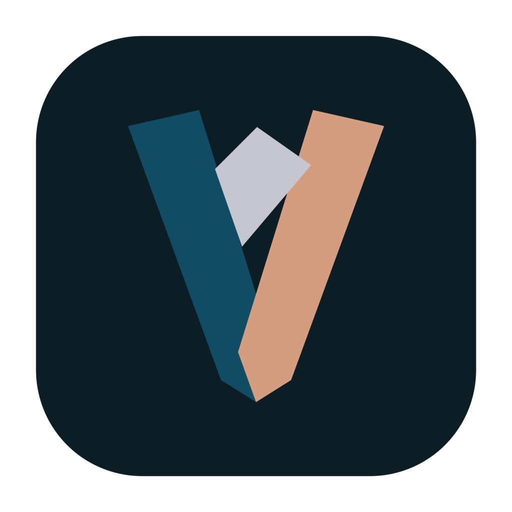

# VybeClip

<p align="center">
  
</p>

VybeClip is an open-source desktop screen recorder and video editor for polished product demos, walkthroughs, tutorials, and branded clips.

The app is currently moving toward its first macOS MVP. The core recording and editing engine comes from Recordly, with a new VybeClip Studio experience, product identity, project format, and workflow maintained by Box Creative Studio.

## MVP Features

- Record a display, window, or application with optional microphone, system audio, and webcam
- Import an existing video into the editor
- Add automatic or manual zooms, cursor styling, backgrounds, framing, crop, captions, audio, and annotations
- Save and reopen `.vybeclip` projects
- Open legacy `.recordly` and `.openscreen` projects
- Export H.264 MP4 video, including source-quality 1080p output
- Reopen recent projects from VybeClip Studio

## Development

Requirements:

- Node.js 20 or newer
- npm
- macOS is the primary MVP platform

Install dependencies and start the renderer:

```bash
npm install
npm run dev
```

In a second terminal, launch the Electron app:

```bash
npx electron .
```

Run the verification suite:

```bash
npm test
npx tsc --noEmit
```

Build the macOS packages:

```bash
npm run build:mac
```

Build artifacts are written to `release/`.

## macOS Permissions

VybeClip requests Screen Recording and Accessibility access when recording requires them. Microphone and Camera access are requested only when those capture options are enabled.

After changing a macOS Privacy & Security permission, quit and reopen VybeClip so the operating system applies it consistently.

## Project Files

New projects use the `.vybeclip` extension. A project stores editor state and references its source media; it does not embed the original recording. Keep source media available at its original path when reopening a project.

Legacy `.recordly` and `.openscreen` files remain supported for migration. A legacy project continues saving in place until it is saved as a new VybeClip project.

## Repository

Issues and MVP feedback are tracked in the [GitHub issue tracker](https://github.com/Alfredoalv13/Recordly/issues).

## License And Attribution

VybeClip is licensed under the [GNU Affero General Public License v3.0](./LICENSE).

VybeClip is based on [Recordly](https://github.com/webadderallorg/Recordly), which originated as a fork of [OpenScreen](https://github.com/siddharthvaddem/openscreen). Their work remains an important part of this codebase and is preserved under the project license and Git history.
